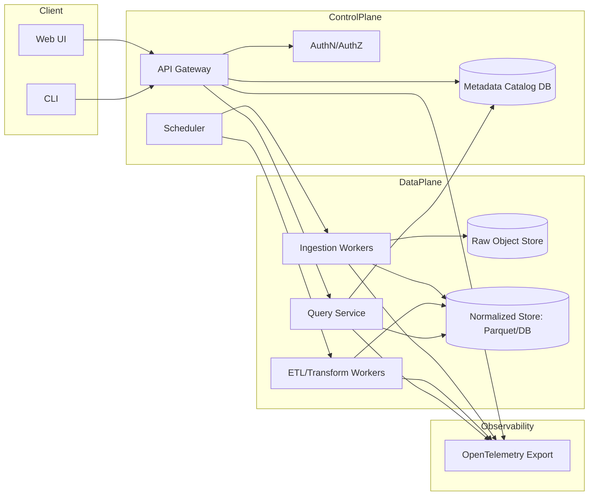
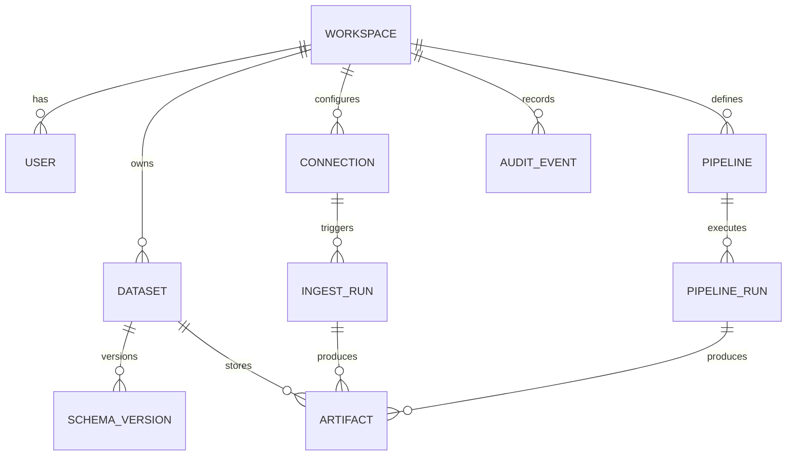
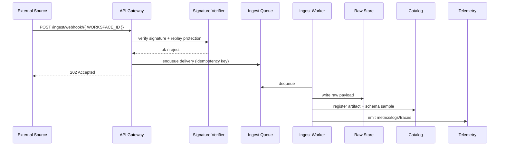
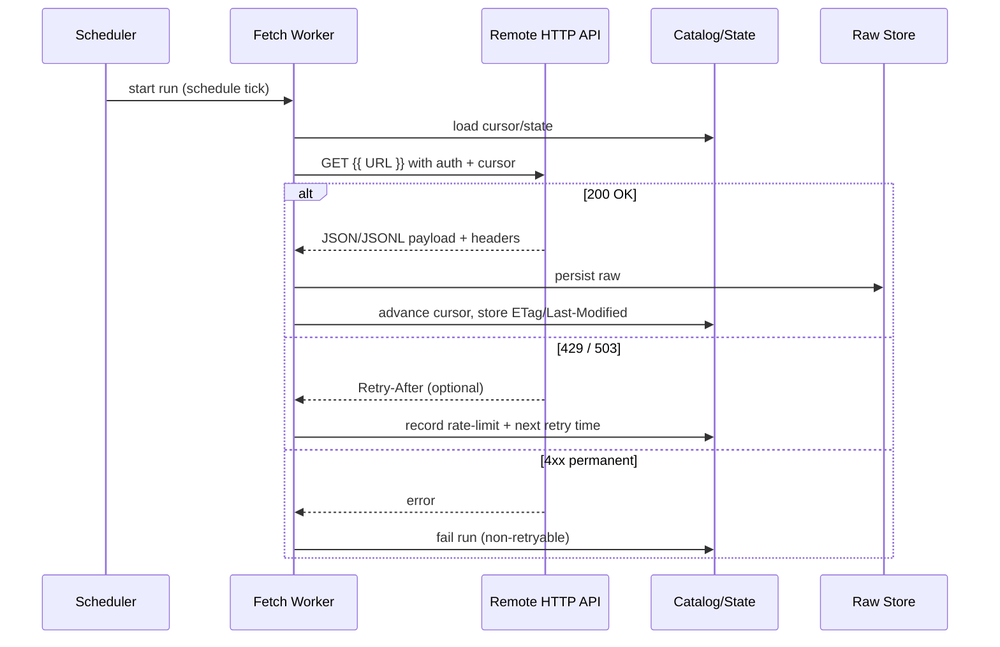

# Requirements for a JSON Query and ETL Web Application

## Executive summary

1. The application’s core value is a unified workflow to **ingest JSON**, **infer/validate schema**, **query**, and **run ETL** from both **local files** and **remote, URL-driven sources** based on open standards for JSON and JSON-adjacent formats. citeturn0search0turn0search1turn0search6  
2. A robust baseline is to treat ingestion as a **job-based pipeline** (capture → validate → normalize → persist → index/catalog), and treat querying/ETL as **repeatable runs** with lineage, retries, and telemetry. This aligns with how mature visual ETL/dataflow tools frame “pipelines/workflows” and lineage/provenance. citeturn16search4turn16search1turn16search0turn16search3  
3. For querying, the most versatile approach is to pick **one canonical execution model** (typically **SQL over tabularized JSON**) and then layer additional JSON query syntaxes (e.g., standard **JSONPath**, **JMESPath**, **JSONata**) as either (a) compiled/transpiled forms, or (b) per-record evaluators. JSONPath has an IETF standard (RFC 9535), which materially reduces ambiguity compared with “informal JSONPath dialects.” citeturn0search3turn3search0turn3search1  
4. If you want “KQL full implementation,” **KQL is ambiguous**: it can mean **Kusto Query Language** (Microsoft ecosystem) or **Kibana Query Language** (Elastic ecosystem). They are not interchangeable: Kibana KQL is explicitly filter-only (no aggregation/transform/sort), while Kusto’s KQL is a full-featured analytics language and has official parsing/intellisense components and editor integrations. citeturn17search3turn1search0turn17search4turn17search1  
5. Schema governance should standardize on **JSON Schema 2020-12** (plus schema versioning), and define how schema inference promotes to a governed schema. If you also publish an HTTP API contract, **OpenAPI 3.1** is designed to be aligned with JSON Schema 2020-12. citeturn2search4turn2search0turn11search5turn11search9  
6. Observability and operations should be first-class: structured logs + metrics + traces should be emitted consistently; **OpenTelemetry** provides a vendor-neutral model/spec across signals, enabling correlation and export to common backends. citeturn5search15turn5search7turn5search11  

## Assumptions and scope boundaries

1. Users and roles (assumed): (a) **Workspace Admin**, (b) **Data Builder** (creates connectors/pipelines), (c) **Analyst** (queries/exports), (d) **Automation Client** (uses API/CLI).  
2. Tenancy (assumed): **multi-tenant** (workspaces/projects) with optional single-tenant deployments.  
3. Data scale (assumed for sizing targets):  
   1) interactive datasets commonly **≤ 10 GB** per dataset, occasional **50–200 GB**;  
   2) record counts up to **10⁸** for batch ingestion (JSON Lines);  
   3) typical concurrent interactive users **10–200** per tenant.  
4. Deployment (assumed): both **self-managed** (Docker/Kubernetes) and optional managed SaaS. citeturn10search6turn10search0turn10search7  
5. Supported sources (assumed baseline): HTTP(S), object storage (S3-compatible), FTP, and at least one database family (PostgreSQL/MySQL) via connectors. citeturn4search0turn5search0turn5search1  
6. Out of scope unless explicitly required later: heavy BI visualization, full data lakehouse governance, and arbitrarily complex distributed joins across petabyte-scale datasets.

## Functional requirements

### Ingestion and connectors

1. **Local upload + drag-drop**  
   1) Browser-based upload must support multi-file selection, drag-drop, and resumable/chunked upload for large files (target: stable uploads up to at least **5–20 GB** depending on deployment).  
   2) Client must compute checksums for integrity, and server must do idempotent “commit” semantics (upload parts → finalize).  
   3) UX must expose parsing mode selection: JSON value, JSON array, JSON Lines, JSON-LD.

2. **File system watch (agent-assisted)**  
   1) Because a web app cannot “watch” a user’s arbitrary local directories without help, provide an optional **local agent** to watch configured paths and push files/records to the server.  
   2) Agent must support: include/exclude globs, backpressure, offline buffering, and a monotonic cursor per file to avoid duplicates.

3. **URL fetch with authentication**  
   1) HTTP connector must support GET/POST and pagination patterns, and honor HTTP caching semantics when enabled (ETag/Last-Modified/Cache-Control) to reduce unnecessary pulls. citeturn4search0turn11search7turn11search3  
   2) Auth methods must include at minimum:  
      1) Basic auth over TLS,  
      2) Bearer tokens (OAuth 2.0 Bearer usage),  
      3) OAuth 2.0 authorization flows (client credentials + auth code for user delegated),  
      4) optional mTLS for enterprise. citeturn4search3turn4search2turn4search1  

4. **Polling**  
   1) Polling schedules must support cron-like expressions and “every N minutes” intervals. In Kubernetes deployments, CronJobs can be a native scheduling substrate for coarse scheduling. citeturn10search5turn10search1  
   2) Polling must implement adaptive backoff on rate limits and transient server failures, using standards like HTTP 429 and Retry-After when provided. citeturn14search4turn14search2  

5. **Webhooks**  
   1) Must provide tenant-scoped webhook endpoints for inbound ingestion.  
   2) Must support signature verification (HMAC or asymmetric signatures) and replay protection. Real-world patterns: GitHub explicitly recommends validating webhook signatures; Stripe signs events and documents signature verification via a dedicated header. citeturn6search2turn6search6turn6search3  
   3) Must deduplicate deliveries using an idempotency key (e.g., delivery ID header + body hash).  

6. **Streaming ingestion**  
   1) Server-sent events (SSE) support for uni-directional push is desirable for “tail -f” style feeds; SSE is standardized via the HTML Living Standard’s EventSource and server-sent events model. citeturn6search0turn6search4  
   2) WebSockets support for bi-directional streaming and interactive subscriptions; WebSocket protocol is defined in RFC 6455 and relies on origin-based security expectations in browsers. citeturn6search1turn6search13  
   3) Optional: Kafka ingestion via Kafka Connect ecosystem (source connectors → topics) if you want enterprise streaming interoperability; Kafka Connect explicitly documents source vs sink connector roles. citeturn5search22turn5search2turn5search6  

7. **Connector coverage** (minimum viable set)  
   1) HTTP(S) (REST APIs, raw JSON URLs). citeturn4search0  
   2) S3-compatible object storage for input/output artifacts; core operations follow the S3 API model (e.g., GetObject/PutObject). citeturn5search4turn5search0  
   3) FTP for legacy sources (RFC 959). citeturn5search1  
   4) Databases as sources/sinks: at least PostgreSQL and/or SQLite for early iterations; both have extensive JSON querying support (PostgreSQL json/jsonb; SQLite JSON1). citeturn13search3turn13search1  
   5) “API connectors”: configurable connectors with templated endpoints, auth, pagination, and JSON extraction rules.

### Supported JSON formats

1. **JSON (single value)**: must conform to JSON as specified by RFC 8259. citeturn0search0  
2. **JSON arrays**: treat as a dataset of records; support streaming decode when feasible (with limits). citeturn0search0  
3. **JSON Lines / newline-delimited JSON**: support as first-class for large datasets; JSON Lines defines record-per-line constraints and is widely used for log-like and streaming-friendly storage. citeturn0search1turn0search9  
4. **JSON-LD 1.1**: support reading and preserving @context/@id semantics and optionally provide JSON-LD framing/compaction/expansion transforms as premium features; JSON-LD 1.1 is a W3C Recommendation. citeturn0search6turn0search2turn0search10  

### Schema detection, validation, and evolution

1. **Schema inference**  
   1) Infer candidate schema from samples or full scan depending on mode; expose confidence metrics and “type conflicts.”  
   2) Support nested objects/arrays; allow “document mode” for heterogeneous records where full tabularization would explode columns.

2. **Schema validation**  
   1) Adopt JSON Schema 2020-12 as the primary schema language (validation + documentation), and store schema versions with dataset history. citeturn2search4turn2search0  
   2) Provide validation policies: strict (reject invalid), permissive (quarantine invalid), and “coerce if safe.”  
   3) Provide path-level error localization using JSON Pointer (RFC 6901) and/or JSONPath (RFC 9535) for rich UI highlighting. citeturn2search1turn0search3  

3. **Schema evolution controls**  
   1) Detect breaking changes (type changes, required-field changes).  
   2) Provide “schema contracts”: producers must comply, or ingestion routes to quarantine.  
   3) Track schema diffs using JSON Patch (RFC 6902) and/or JSON Merge Patch (RFC 7396) for reproducible migrations. citeturn2search2turn2search3  

### Query capabilities (including KQL)

1. **SQL-like querying as the canonical execution path**  
   1) Provide a SQL dialect with JSON functions and table-valued JSON shredding functions via an embedded engine (common choices include DuckDB-style JSON table functions like json_each/json_tree and automatic JSON loading/type deduction patterns). citeturn3search2turn3search6turn3search10  
   2) Optional distributed mode can rely on engines that support JSON path functions (e.g., Trino’s json_exists/json_query/json_value family). citeturn3search3turn3search7  

2. **JSONPath (standardized)**  
   1) Must support RFC 9535 JSONPath expressions for selecting/extracting multiple values from a JSON document. citeturn0search3turn0search7  

3. **JMESPath**  
   1) Must support core JMESPath (spec-defined grammar + semantics), optimized for per-record filtering/projection in ingestion and transformations. citeturn3search0turn3search4turn3search8  

4. **JSONata (optional but high leverage)**  
   1) Provide JSONata as an advanced transform/query layer for shaping JSON outputs; JSONata explicitly positions itself as a query/transformation language for JSON. citeturn3search1turn3search9  

5. **KQL “full implementation” decision (critical fork)**  
   1) **Interpretation A: Kusto Query Language (Microsoft)**  
      1) Kusto KQL is documented as a primary query language across Microsoft’s data/monitoring ecosystem (Azure Data Explorer, Azure Monitor, Microsoft Sentinel). citeturn1search0turn1search4  
      2) Official components exist for parsing and editor features: Kusto.Language can parse queries into syntax trees; monaco-kusto provides editor features (completion, diagnostics, etc.). citeturn17search4turn17search1turn17search5  
      3) For JSON handling, KQL has a “dynamic” type and functions like parse_json() to interpret strings as JSON-like values. citeturn15search0turn15search4turn15search3  
      4) **What “full implementation” realistically means** (recommendation):  
         1) If you need high fidelity with Kusto semantics, the most reliable approach is to **execute queries on a Kusto engine** (e.g., Azure Data Explorer) and treat your app as a governed UX + orchestration layer. This also unlocks ingestion-time transforms like update policies (transform on ingest). citeturn15search5turn15search2  
         2) If you need self-hosted independence, implement **a defined subset**: parse with Kusto.Language, translate a supported operator/function subset into your canonical SQL/plan, and document non-supported constructs. OSS evidence suggests “subset + translation” is common because Kusto semantics differ from other engines (example: rust-kql explicitly states subset support due to engine differences). citeturn17search2turn7search2  
   2) **Interpretation B: Kibana Query Language (Elastic)**  
      1) Kibana KQL is explicitly documented as filter-only (no aggregations/transforms/sorting). If you implement Kibana KQL, position it as a UI filter syntax only, not as a full query/ETL language. citeturn17search3turn1search3  

### Transformation and ETL

1. **Transformation graph model**  
   1) Pipelines must be represented as a DAG of steps (extract → transforms → load), similar to how mature visual pipeline tools describe “transforms connected by hops” and separate “pipelines” (data work) from “workflows” (orchestration, error handling). citeturn16search4turn16search1turn16search12  
2. **Required transform operators (baseline)**  
   1) mapping/renaming, computed fields, templated extraction (JSONPath/JMESPath),  
   2) flatten/un-nest arrays/objects with controlled explosion,  
   3) joins (record-to-record, record-to-dimension),  
   4) enrichment (HTTP lookup, dictionary mapping),  
   5) type coercion + normalization (string→number/date; null coercion),  
   6) deduplication (key-based + fuzzy optional),  
   7) batching/windowing for sinks and rate-limited APIs.  
3. **Incremental and stateful ingestion**  
   1) Incremental sync mode must exist for remote sources that support cursoring/CDC patterns; “incremental means only changed/new since last sync” is a standard connector concept in leading integration platforms. citeturn16search2turn16search19  
4. **Lineage/provenance**  
   1) Every run must record lineage: source artifact(s) → transform version → output artifact(s). Provenance/lineage is a known differentiator of mature dataflow systems and is operationally essential for debugging. citeturn16search3turn16search0  

### Scheduling, retries, and operational handling

1. **Scheduling**  
   1) Support cron expressions, fixed-interval schedules, and event-driven triggers (webhook/stream).  
   2) For Kubernetes deployments, provide an option to map schedules to CronJobs for operational simplicity in some environments. citeturn10search5turn10search1  
2. **Error handling + retries**  
   1) Must classify errors: transient (retry), permanent (fail), quarantinable (bad records), and policy violations (security/schema).  
   2) Must support exponential backoff + jitter, and must respect Retry-After when provided by upstream systems; 429 semantics are standardized and explicitly allow Retry-After guidance. citeturn14search4turn14search2  
3. **Observability hooks**  
   1) All connector and pipeline operations must emit logs/metrics/traces with consistent correlation IDs; OpenTelemetry defines signal models and correlation patterns for vendor-neutral export. citeturn5search15turn5search3turn5search11  

## Nonfunctional requirements

1. **Performance targets (define as SLOs per deployment tier)**  
   1) Interactive query latency (cached metadata, warm engine): p95 **≤ 2,000 ms** for “preview queries” on **≤ 1 GB** scanned data.  
   2) Batch ingestion throughput: target **50–500 MB/s** per worker for JSON Lines when CPU allows (deployment-dependent).  
   3) Concurrency: at least **N = 20** concurrent interactive query sessions per mid-size tenant without cross-tenant interference.

2. **Scalability model**  
   1) Scale-out ingestion workers independently from query workers.  
   2) Partition storage by tenant + dataset + time/partition key.  
   3) Plan for both “embedded single-node” mode and “distributed query service” mode.

3. **Storage/backends**  
   1) In-memory: fast preview and small datasets; enforce hard memory quotas.  
   2) Local file-backed: embedded DB files for quick iteration; embedded engines can persist to a single-file DB model (example: DuckDB describes persistent single-file database support and ACID properties). citeturn12search3turn12search15  
   3) Database-backed catalogs: relational DB for metadata/state (tenants, jobs, runs, schemas).  
   4) Object store: store raw inputs + normalized columnar outputs; Parquet is a standard open columnar format with an Apache-maintained specification, typically paired with columnar in-memory formats like Apache Arrow. citeturn7search0turn7search16turn7search1  

4. **Concurrency controls**  
   1) Per-tenant quotas: max concurrent jobs, max query slots, max worker CPU/memory.  
   2) Queueing: FIFO by default, with priority lanes (P0 incident datasets, admin jobs).

5. **Security**  
   1) Transport security: TLS 1.3 support is recommended; TLS 1.3 is standardized in RFC 8446. citeturn4search3turn4search11  
   2) Authn/z: OAuth 2.0 for delegated access (RFC 6749) and Bearer tokens over TLS (RFC 6750). citeturn4search1turn4search2  
   3) Token formats: JWT as an interoperable option (RFC 7519), with clear rotation and revocation strategies. citeturn9search2turn9search10  
   4) Browser security: strict CORS policy and preflight handling per Fetch standard definitions. citeturn9search3turn9search3  
   5) Rate limiting and abuse controls: return 429 with Retry-After where appropriate. citeturn14search4turn14search2  
   6) Webhook security: signature verification is mandatory (GitHub/Stripe patterns). citeturn6search2turn6search3  
   7) Secure development baseline: align threat model and controls with OWASP guidance (Top 10 awareness + ASVS verification framework). citeturn9search0turn9search9turn9search1  

6. **Compliance and auditability (requirements, not legal advice)**  
   1) Comprehensive audit logs (auth events, connector changes, pipeline edits, data exports).  
   2) Data retention controls per dataset/tenant.  
   3) Data residency option (deployment selectable).  
   4) PII handling: field-level masking in preview, export controls, and “quarantine” zones.

7. **Cost considerations**  
   1) Primary cost drivers: (a) data egress for URL sources/object store, (b) compute for schema inference + shredding, (c) persistent storage for raw + normalized copies, (d) indexes/caches.  
   2) Provide “cost guardrails”: max bytes fetched/day, max runs/day, max retention GB, and budgets per tenant.

## UX, API, and developer tooling

1. **Web UI**  
   1) Dataset-centric navigation: datasets → schema → queries → pipelines → runs → outputs.  
   2) Preview-first: show a sample (e.g., first 1,000 records) and inferred schema before committing to full ingestion.  
   3) Schema editor: visual diff, constraints, required/optional fields mapped to JSON Schema terms. citeturn2search4turn2search0  
   4) Visual ETL builder: node-based pipeline editor inspired by established “drag components to canvas and connect flows” UX patterns (e.g., NiFi-style dataflow canvas concepts). citeturn8search11turn8search15turn8search12  

2. **Query editor experience**  
   1) SQL editor with result grid, chart preview, and export.  
   2) JSONPath/JMESPath test harness (input JSON + expression + output). citeturn0search3turn3search0  
   3) If supporting **Kusto KQL**: integrate Monaco editor language service; Microsoft documents monaco-kusto integration and schema injection for editor intelligence. citeturn17search1turn17search5  

3. **APIs**  
   1) REST API as the operational backbone; document with OpenAPI 3.1 for tooling compatibility. citeturn11search9turn11search5  
   2) Optional GraphQL API for flexible UI data fetching; GraphQL is standardized via the GraphQL specification. citeturn11search0turn11search8  

4. **CLI**  
   1) Must support: login, create dataset, upload files, create connector, run pipeline, fetch run logs, export results.  
   2) Must be scriptable (CI-friendly), with JSON output formats and exit codes.

5. **Import/export formats**  
   1) Import: JSON, JSON Lines, JSON-LD. citeturn0search0turn0search1turn0search6  
   2) Export: JSON Lines, CSV, Parquet, and “query result bundles.” Parquet is an Apache-specified format suited for analytics interchange. citeturn7search0turn7search16  

### Sample REST endpoints and payloads (illustrative)

```http
POST /v1/workspaces
Authorization: Bearer {{ ACCESS_TOKEN }}
Content-Type: application/json

{
  "name": "acme-labs",
  "region": "ap-southeast-2"
}
```

```http
201 Created
Content-Type: application/json

{
  "workspaceId": "{{ WORKSPACE_ID }}",
  "name": "acme-labs",
  "createdAt": "2026-03-06T00:00:00Z"
}
```

```http
POST /v1/datasets
Authorization: Bearer {{ ACCESS_TOKEN }}
Content-Type: application/json

{
  "workspaceId": "{{ WORKSPACE_ID }}",
  "name": "billing-events",
  "ingest": { "format": "jsonl" }
}
```

```http
POST /v1/datasets/{{ DATASET_ID }}/uploads
Authorization: Bearer {{ ACCESS_TOKEN }}
Content-Type: application/json

{
  "files": [
    { "fileName": "events-2026-03-01.jsonl", "sizeBytes": 4123456789 }
  ]
}
```

```http
POST /v1/queries:run
Authorization: Bearer {{ ACCESS_TOKEN }}
Content-Type: application/json

{
  "workspaceId": "{{ WORKSPACE_ID }}",
  "datasetId": "{{ DATASET_ID }}",
  "language": "sql",
  "query": "SELECT count(*) AS n FROM dataset WHERE json_extract_scalar(payload, '$.type') = 'invoice_paid';",
  "limit": 1000
}
```

```http
200 OK
Content-Type: application/json

{
  "queryId": "{{ QUERY_ID }}",
  "status": "succeeded",
  "stats": { "bytesScanned": 987654321, "durationMs": 642 },
  "columns": [{ "name": "n", "type": "BIGINT" }],
  "rows": [[123456]]
}
```

```http
POST /v1/pipelines
Authorization: Bearer {{ ACCESS_TOKEN }}
Content-Type: application/json

{
  "workspaceId": "{{ WORKSPACE_ID }}",
  "name": "billing-normalize-v1",
  "steps": [
    { "op": "extract", "mode": "jsonl" },
    { "op": "coerce", "rules": [{ "path": "$.amount", "type": "decimal(18,2)" }] },
    { "op": "dedupe", "keys": ["$.event_id"] },
    { "op": "write", "format": "parquet", "partitionBy": ["$.event_date"] }
  ]
}
```

## Reference architecture, data models, and flows

### Architecture overview (conceptual)



(OpenTelemetry is used here as the standard telemetry export model.) citeturn5search15turn5search7  

### Core data model (minimum entities)



Suggested key fields (non-exhaustive):
1. WORKSPACE: workspace_id, name, plan, region, created_at  
2. USER: user_id, workspace_id, email, role, status  
3. DATASET: dataset_id, workspace_id, name, ingest_format, created_at  
4. SCHEMA_VERSION: schema_id, dataset_id, json_schema, status, created_at citeturn2search4turn2search0  
5. CONNECTION: connection_id, workspace_id, type (http/s3/ftp/db), auth_ref, config_json  
6. INGEST_RUN / PIPELINE_RUN: run_id, status, started_at, finished_at, metrics_json, error_summary  
7. ARTIFACT: artifact_id, dataset_id, kind (raw/normalized/export), uri, checksum, size_bytes  
8. AUDIT_EVENT: event_id, actor_id, action, resource_ref, timestamp, ip

### Webhook ingestion flow (sequence)



(Signature verification is explicitly recommended and documented in major webhook ecosystems.) citeturn6search2turn6search3turn5search15  

### URL polling flow with backoff (sequence)



(HTTP semantics define Retry-After usage; 429 explicitly permits Retry-After for rate limiting.) citeturn14search4turn14search2turn4search0  

## Tooling landscape and recommended tech stacks

### Similar tools comparison

| Tool | Primary focus | Strengths relevant to your app | Gaps vs your requested “query + JSON ETL web app” |
|---|---|---|---|
| Airbyte | Data replication/connectors | Large connector catalog concept and incremental sync patterns | Not primarily an interactive JSON query + schema editor product; querying is typically downstream citeturn8search0turn16search2 |
| Meltano (Singer ecosystem) | ELT via CLI + Singer connectors | CLI-first pipeline management and connector standardization via Singer | Less “web-native interactive query/preview” out of the box citeturn8search7turn8search1 |
| Apache NiFi | Visual dataflow automation | Drag-drop flow design; strong lineage/provenance concepts | Heavyweight for an embedded-in-your-app experience; query experience is not the primary UX citeturn8search11turn16search3turn16search0 |
| Apache Hop | Visual pipelines + workflows | Clear separation of pipelines (data transforms) and workflows (orchestration/error handling) | Not a “JSON query web app” per se; more a dedicated orchestration/ETL environment citeturn16search4turn16search1turn16search8 |
| DuckDB | Embedded SQL analytics engine | JSON loading + JSON table functions + SQL execution in-process | Needs you to build multi-tenant control plane + connectors + UI around it citeturn3search6turn3search2turn12search3 |
| Apache DataFusion | Embeddable query engine library | Extensible planner/execution; Arrow-native; multi-threaded/vectorized design | You must build ingestion, storage adapters, and semantic layers citeturn7search2turn7search6turn17search18 |
| Azure Data Explorer | Managed analytics + Kusto KQL | Strong KQL ecosystem; JSON ingestion examples; ingest-time transforms (update policies) | Cloud service dependency if you want “true KQL”; costs and vendor lock-in tradeoffs citeturn15search2turn15search5turn1search0 |
| Elastic/Kibana KQL | UI filtering language | Simple filter syntax for documents | Not a full analytics/ETL language (filter-only) citeturn17search3turn1search3 |

image_group{"layout":"carousel","aspect_ratio":"16:9","query":["Apache NiFi web UI dataflow canvas screenshot","Airbyte connections UI screenshot","Apache Hop GUI pipeline screenshot","Azure Data Explorer web UI Kusto query screenshot"],"num_per_query":1}

### Recommended tech stack options (with pros/cons)

| Option | When it fits | Core components | Pros | Cons |
|---|---|---|---|---|
| Embedded analytics stack | Single-node or modest multi-tenant; fast time-to-value | SQL engine: DuckDB; storage: local + object store; catalog DB: Postgres; UI: React; API: FastAPI/Node | Very fast dev loop; strong JSON support + auto schema detection patterns; simple ops in self-hosted mode citeturn3search6turn3search2turn12search3 | Harder to scale distributed concurrency; needs careful sandboxing per tenant |
| Service-oriented query plane | Productized multi-tenant SaaS; pluggable backends | Query service: DataFusion (Arrow); storage: Parquet + object store; orchestration: worker queues; catalog: Postgres | Extensible query engine for product embedding; Arrow-native; good path to custom connectors/operators citeturn7search2turn7search6turn7search1 | More engineering upfront (connectors, caching, optimizer tuning) |
| External engine delegation | Enterprises already standardized on Trino/ADX/etc. | Query pushes down to Trino or ADX; your platform provides ingestion, governance, UI, lineage | Leverages mature distributed engines; reduces need to implement heavy query optimization citeturn3search3turn15search16 | Operational complexity + external dependencies; portability concerns |

### KQL implementation options (to satisfy “full implementation” intent)

| KQL target | Implementation strategy | What you can truthfully support | Primary risks |
|---|---|---|---|
| Kusto KQL | Delegate execution to Azure Data Explorer; embed editor (monaco-kusto) | “Full KQL” semantics as implemented by Kusto engine; JSON via dynamic + parse_json; ingest-time transforms via update policies citeturn17search1turn15search0turn15search5 | Vendor dependency + cost; data residency constraints |
| Kusto KQL | Self-hosted subset via parse/analyze + translate to SQL plan | Documented subset (operators/functions); high-quality editor diagnostics; deterministic behavior citeturn17search4turn17search2 | “Subset drift” as users expect full KQL; long tail of functions/operators |
| Kibana KQL | Implement as filter parser → query predicate | Filter-only behavior consistent with Kibana KQL docs citeturn17search3 | Users may expect joins/aggregations (not in scope for this KQL) |

## Prioritized user stories and acceptance criteria

### P0 (must ship to claim “JSON query + ETL platform”)

1. **US-01 (P0): Workspace isolation**  
   As a Workspace Admin, I want tenant-isolated datasets, pipelines, and secrets so that multiple teams can use the platform safely.  
   Acceptance criteria:  
   1) Every API request is scoped to {{ WORKSPACE_ID }}; cross-workspace access is denied by default.  
   2) Per-workspace quotas can be configured (max concurrent runs, max storage GB).  
   3) Audit events exist for create/update/delete of datasets, connectors, pipelines.

2. **US-02 (P0): Upload JSON and preview**  
   As a Data Builder, I want to upload JSON/JSONL files and preview parsed records and inferred schema before ingesting the full dataset.  
   Acceptance criteria:  
   1) Supports JSON (RFC 8259) and JSON Lines parsing modes. citeturn0search0turn0search1  
   2) Preview shows first N records + parse errors with paths (JSON Pointer/JSONPath). citeturn2search1turn0search3  
   3) User can “commit ingest” or “discard upload” without partial dataset pollution.

3. **US-03 (P0): Governed schema with versioning**  
   As a Data Builder, I want inferred schema promoted to a JSON Schema version so that ingestion and downstream queries are stable.  
   Acceptance criteria:  
   1) Schema stored as JSON Schema 2020-12 and versioned per dataset. citeturn2search4turn2search0  
   2) Ingestion can run in strict/permissive modes; invalid records can be quarantined.  
   3) Schema diffs are produced (JSON Patch or Merge Patch representation). citeturn2search2turn2search3  

4. **US-04 (P0): SQL query over ingested data**  
   As an Analyst, I want to write SQL queries and export results so that I can analyze JSON-derived datasets.  
   Acceptance criteria:  
   1) Queries can read nested JSON via JSON functions and/or shredded columns. citeturn3search2turn3search6  
   2) Results export to CSV and JSON Lines; large export is async with a downloadable artifact. citeturn0search1turn0search9  

5. **US-05 (P0): Deterministic pipeline runs**  
   As a Data Builder, I want to build an ETL pipeline and run it with a pinned version so that outputs are reproducible.  
   Acceptance criteria:  
   1) Pipeline definitions are versioned and immutable once published.  
   2) Each run records input artifacts + pipeline version + output artifacts (lineage). citeturn16search3turn16search0  

### P1 (expands ingestion and query sophistication)

6. **US-06 (P1): HTTP connector with OAuth and incremental state**  
   As a Data Builder, I want an HTTP connector that supports OAuth2 and incremental polling so that I can sync APIs efficiently.  
   Acceptance criteria:  
   1) OAuth2 client credentials supported; tokens stored encrypted. citeturn4search1turn4search2  
   2) Connector stores cursor/state and supports incremental sync patterns. citeturn16search2turn16search22  
   3) Rate-limit handling uses 429/Retry-After when present. citeturn14search4turn14search2  

7. **US-07 (P1): Webhook ingestion with signatures**  
   As a Data Builder, I want to ingest via webhook endpoints with signature verification so that inbound event feeds are safe.  
   Acceptance criteria:  
   1) Signature verification required for configured sources (HMAC secret). citeturn6search2turn6search6  
   2) Replay protection via timestamp tolerance + nonce/delivery-id store.  
   3) Idempotent processing (same delivery-id does not double-ingest).

8. **US-08 (P1): JSONPath + JMESPath expressions**  
   As an Analyst, I want JSONPath/JMESPath query panes so that I can quickly extract fields from semi-structured records.  
   Acceptance criteria:  
   1) RFC 9535 JSONPath supported. citeturn0search3turn0search7  
   2) JMESPath spec supported for extraction/filters. citeturn3search0turn3search8  

9. **US-09 (P1): Visual pipeline builder**  
   As a Data Builder, I want a drag-drop ETL builder so that I can compose transforms without writing code.  
   Acceptance criteria:  
   1) Node-based canvas; steps connect as a DAG; validation prevents cycles.  
   2) Supports core transforms (map/flatten/join/dedupe/coerce).  
   3) Provenance view shows step-by-step lineage akin to “show lineage” concepts. citeturn16search0turn16search3  

### P2 (advanced language support and enterprise readiness)

10. **US-10 (P2): Kusto KQL editor + execution mode**  
   As an Analyst, I want to author Kusto KQL with autocomplete and run it so that existing KQL users can reuse skills.  
   Acceptance criteria:  
   1) Monaco Kusto language integration provides diagnostics and completion. citeturn17search1turn17search5  
   2) Platform clearly declares execution mode: “Kusto-backed full KQL” vs “subset KQL translated.” citeturn17search2turn15search16  
   3) JSON extraction examples work using dynamic + parse_json when in Kusto-backed mode. citeturn15search0turn15search4  

11. **US-11 (P2): Streaming UI tail**  
   As an Analyst, I want to tail streaming JSON feeds in the UI so that I can debug near-real-time pipelines.  
   Acceptance criteria:  
   1) SSE endpoint available for “tail” sessions. citeturn6search0turn6search4  
   2) Optional WebSocket subscriptions for duplex interactions. citeturn6search1turn6search13  

12. **US-12 (P2): Compliance-grade audit export**  
   As an Admin, I want exportable audit logs and retention policies so that I can meet internal compliance requirements.  
   Acceptance criteria:  
   1) Audit events include actor, action, resource, timestamp, and IP.  
   2) Immutable log storage option; export to object store.

